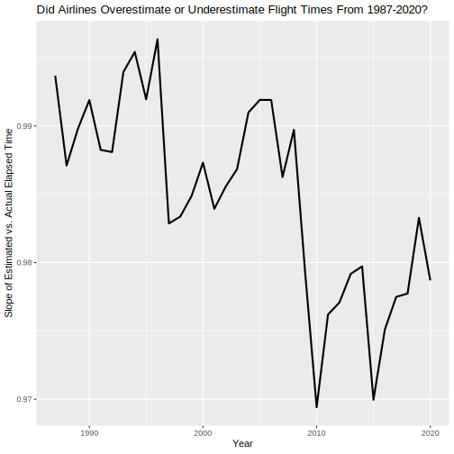
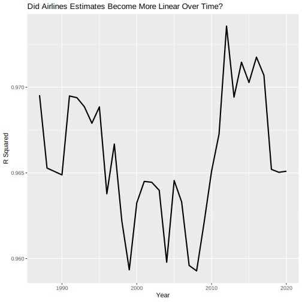
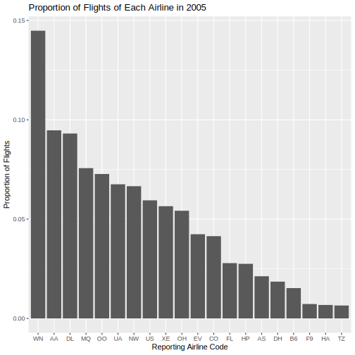
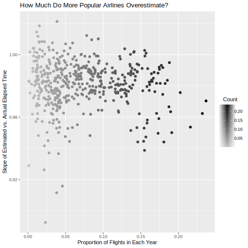
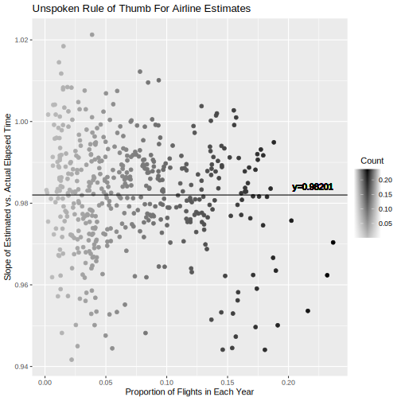

# Analysis of Airline Flights From 1987-2020
### Harry Bauman

## Introduction

I found that as an industry, airlines have become more conservative in their estimates of flight times over the last 30 years. In other words, airlines in 2020 allocated more time in their estimate for unexpected delays compared to airlines in 1987. Furthermore, more popular airlines (those with a greater proportion of yearly flights) seem to have an unpublicized rule of thumb to overestimate the flight time by a factor of 1.02.

I show the first point by plotting the slopes of the linear regression between estimated and actual flight time for each year. The second point by plotting the slope of the linear regression of estimated and actual flight time for each airline in a year against that airline's proportion of flights in the year.

- What will your supporting arguments be for your discovery?

## Dataset

I used the flight data [available from IBM](https://developer.ibm.com/exchanges/data/all/airline/). The main data set contains records from approximately 200 million domestic US flights reported to the Untied States Bureau of Transportation Statistics. IBM provides this data set to aid the training of artifical intelligence and other computational models that predict the likelihood of a flight arriving on time. However, since the full data set is 81GB, I used the 2 million row sample data set that IBM generated by randomly sampling the full data set (which is only about 7GB).

Just like the computer scientists at IBM, I'm interested in understanding the airline industry's behavior in predicting and completing their flights.

## Initial Questions

I was initially drawn to this data by how easy it was to download and the number of parameters that are recorded for each flight. Among other things, the data set records:

- The date of the flight
- The airline completing the flight
- The origin/destination for the flight (in several different formats for ease of analysis)
- The departure/arrival times
- The delay for departure/arrival
- The estimated total elapsed time
- The actual total elapsed time

After examining the column headings, I developed three questions that I was curious about:

1. How do delay times relate to the length of the flight? In other words, are longer flights more likely to be delayed?
2. Is there a correlation between airline company and length of delays?
3. Are there geographic regions that are more susceptible to delays?

As I worked with the data, I answered the first question and then combined it with the second question to investigate whether certain airlines (specifically more popular airlines) tended to overestimate or underestimate the actual flight time. I did not explore the third question, as the analysis and data wrangling for the first two was significant and did not overlap with the data wrangling that it would have needed.

As seen in the [Discoveries & Insights](#discoveries--insights) section, I was surprised to find that despite having a clear linear relation, the models between estimated and actual flight times have not become more linear over the last 30 years.

This data was moderately easy to work with. It required some relatively major reshaping, which was easy accomplished by R once I understood the syntax that was required to create the data structures that I wanted. Since the data was so large, however, I spent a lot of time waiting for my computer to process and visualize the data to see whether I had correctly entered the instructions that I wanted.

## Discoveries & Insights

Images should be large and easy to see and interperate. 
Captions underneath should be 20-70 words long.

In order to to explore the first question, the data are divided into years and the actual flight time is plotted against the estimated flight time. Linear regression models are then created for each year and the slope is extracted from the model. The graph below shows the a subset of this process for the years 1990, 2000, 2010, and 2020 with the slope of the linear regression shown on each chart.

The slopes for each year are plotted in the graph below. Interestingly, the slope has generally decreased over time, but it was not a smooth progression. In fact, the data seems to repeat a pattern of moderate increase followed by a sharp decrease.

When viewing the data shown in the first plot, it is reasonable to wonder if the relationship between the airlines' predictions and the actual flight time has become more linear over time as the airlines have developed better models. The plot below shows the R^2 value for the linear regression on each year of data. The flight data is clearly linear (as the R^2 values are between 0.965 and 0.975), but the goodness of fit stays roughly constant over the last 30 years.

In order to explore whether certain airlines were more likely to overestimate the flight time, the data was further split into categories for each airline in each year and a similar linear regression was calculated for estimated vs. actual flight time for each airline in each year. 2005 is shown below as an example:

For each year, the proportion of flights that each airline flew was also caluclated. For example, the following plot shows the proportion of flights that each airline flew in 2005:

For each airline in each year, the popularity was then plotted against the slope of the regression line as shown. Airlines that fly the most flights are emphasized since their popularity is indicative of a good balance between cost (overestimating flight time means that they have to schedule more employees even if flights arrive early) and consumer relations (travelers do not respond well to delays).

While the data is largely symmetric, there are some outliers. The following graph shows all data points with slope greater than 0.94. The trimmed data converges on the mean of 0.98201 as shown:

## Conclusion

The data show several interesting observations. First, the relationship between estimated and actual flight time is linear. Furthermore, while the data has roughly maintained a constant linearity (how close it is to being perfectly linear), the slope between those variables has generally decreased between 1980 and 2020. Additionally, the more popular airlines in the industry generally converge around a slope of 0.98201 between the estimated and actual flight time. Taking the inverse of that slope indicates that airlines generally overestimate the flight time by a factor of approximately 1.02.

## Sources

The data (including the full 200 million flight data set) can be downloaded from IBM [here](https://developer.ibm.com/exchanges/data/all/airline/).

The data reports the airline for each flight using the International Air Transport Association (IATA). In order to find the full name of the airline, you can use the lookup tool on the [IATA Website](https://www.iata.org/en/publications/directories/code-search/).
